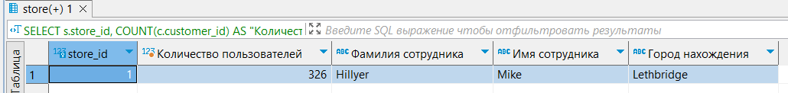
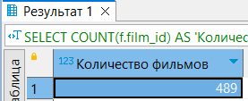
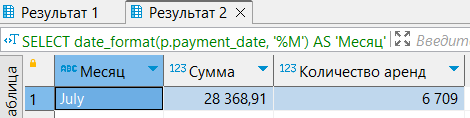
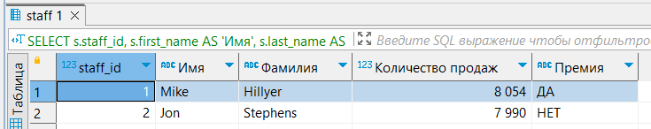
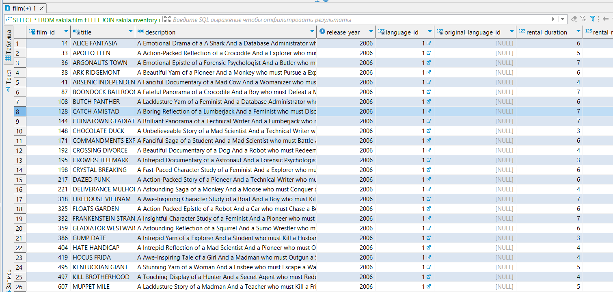

# Домашнее задание к занятию 12.4. «SQL. Часть 2» - Гумлевой Александр

### Задание 1

Одним запросом получите информацию о магазине, в котором обслуживается более 300 покупателей, и выведите в результат следующую информацию: 
- фамилия и имя сотрудника из этого магазина;
- город нахождения магазина;
- количество пользователей, закреплённых в этом магазине.

  

```sql
SELECT s.store_id, COUNT(c.customer_id) AS "Количество пользователей", st.last_name AS "Фамилия сотрудника", st.first_name AS "Имя сотрудника", ci.city AS "Город нахождения"
FROM sakila.store s
JOIN sakila.customer c ON s.store_id = c.store_id
JOIN sakila.staff st ON s.manager_staff_id = st.staff_id 
JOIN sakila.address a ON s.address_id = a.address_id
JOIN sakila.city ci ON a.city_id = ci.city_id
GROUP BY s.store_id
HAVING COUNT(c.customer_id) > 300
```

### Задание 2

Получите количество фильмов, продолжительность которых больше средней продолжительности всех фильмов.



```sql
SELECT COUNT(f.film_id) AS 'Количество фильмов'
FROM sakila.film f
WHERE f.`length` > (SELECT AVG(f.`length`) FROM sakila.film f)
```

### Задание 3

Получите информацию, за какой месяц была получена наибольшая сумма платежей, и добавьте информацию по количеству аренд за этот месяц.



```sql
SELECT date_format(p.payment_date, '%M') AS 'Месяц', SUM(p.amount) AS 'Сумма', COUNT(p.rental_id) AS 'Количество аренд'
FROM sakila.payment p
GROUP BY date_format(p.payment_date, '%M')
ORDER BY 2 DESC 
LIMIT 1
```

### Задание 4*

Посчитайте количество продаж, выполненных каждым продавцом. Добавьте вычисляемую колонку «Премия». Если количество продаж превышает 8000, то значение в колонке будет «Да», иначе должно быть значение «Нет».



```sql
SELECT s.staff_id, s.first_name AS 'Имя', s.last_name AS 'Фамилия', COUNT(p.payment_id) AS 'Количество продаж', IF(COUNT(p.payment_id)>8000, 'ДА', 'НЕТ') AS 'Премия'
FROM sakila.staff s JOIN sakila.payment p ON s.staff_id = p.staff_id
GROUP BY s.staff_id
```

### Задание 5*

Найдите фильмы, которые ни разу не брали в аренду.



```sql
SELECT *
FROM sakila.film f LEFT JOIN sakila.inventory i ON i.film_id = f.film_id
WHERE i.inventory_id IS NULL;
```